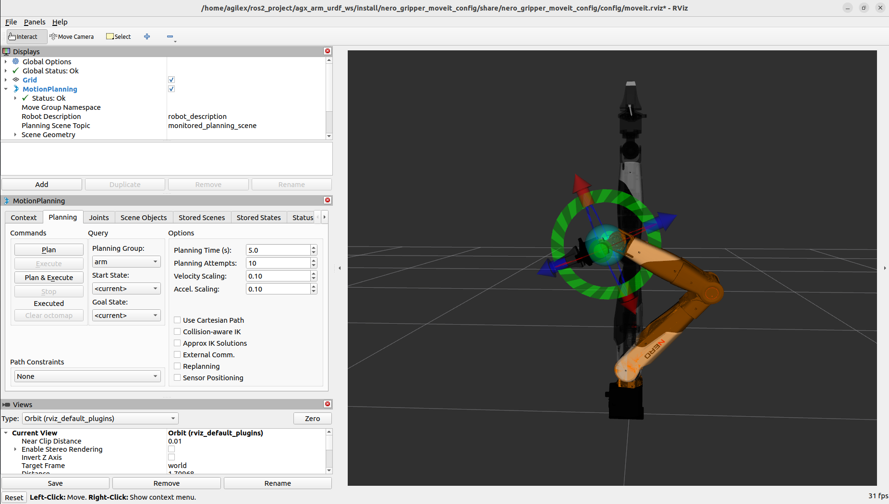
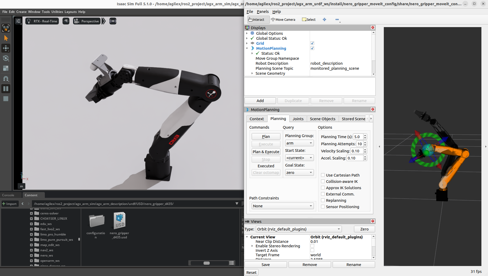

# Moveit2 README

本目录为 AgileX 系列机械臂的 MoveIt2 运动规划配置包集合，为每个机械臂型号提供了独立的 MoveIt2 配置，包含运动学求解、碰撞检测、轨迹规划的完整配置，支持机械臂的运动规划开发，同时可与 Isaac Sim 完成联合仿真。

## 目录结构

本目录下为各个型号的独立 MoveIt2 配置包，每个配置包对应一个机械臂型号，包含了该型号的运动规划相关配置：

- `nero_gripper_moveit_config`：Nero 机械臂的 MoveIt2 配置包
- `piper_gripper_moveit_config`：Piper 机械臂的 MoveIt2 配置包
- `piper_h_gripper_moveit_config`：Piper H 机械臂的 MoveIt2 配置包
- `piper_l_gripper_moveit_config`：Piper L 机械臂的 MoveIt2 配置包
- `piper_x_gripper_moveit_config`：Piper X 机械臂的 MoveIt2 配置包

## 以 Nero 为例的使用方法

### 1. 单独启动 MoveIt2 演示调试

你可以直接启动 MoveIt2 的演示节点，在 RViz2 中完成运动规划的调试，无需启动外部仿真环境：

```bash
# 启动 Nero 机械臂的 MoveIt2 演示节点
ros2 launch nero_gripper_moveit_config demo.launch.py
```

启动完成后，RViz2 会自动加载 Nero 机械臂的模型，你可以使用 MoveIt2 提供的交互标记，拖动机械臂的末端执行器，即可自动完成运动规划，验证规划效果。

### 2. 与 Isaac Sim 联合仿真

你可以将 MoveIt2 与 Isaac Sim 联合，完成高保真的物理仿真，实现运动规划的真实物理效果测试，具体步骤如下：

# Moveit2 README

本目录为 AgileX 系列机械臂的 MoveIt2 运动规划配置包集合，为每个机械臂型号提供了独立的 MoveIt2 配置，包含运动学求解、碰撞检测、轨迹规划的完整配置，支持机械臂的运动规划开发，同时可与 Isaac Sim 完成联合仿真。

## 目录结构

本目录下为各个型号的独立 MoveIt2 配置包，每个配置包对应一个机械臂型号，包含了该型号的运动规划相关配置：

- `nero_gripper_moveit_config`：Nero 机械臂的 MoveIt2 配置包
- `piper_gripper_moveit_config`：Piper 机械臂的 MoveIt2 配置包
- `piper_h_gripper_moveit_config`：Piper H 机械臂的 MoveIt2 配置包
- `piper_l_gripper_moveit_config`：Piper L 机械臂的 MoveIt2 配置包
- `piper_x_gripper_moveit_config`：Piper X 机械臂的 MoveIt2 配置包

## 以 Nero 为例的使用方法

### 1. 单独启动 MoveIt2 演示调试

你可以直接启动 MoveIt2 的演示节点，在 RViz2 中完成运动规划的调试，无需启动外部仿真环境：

```bash
# 启动 Nero 机械臂的 MoveIt2 演示节点
ros2 launch nero_gripper_moveit_config demo.launch.py
```

启动完成后，RViz2 会自动加载 Nero 机械臂的模型，你可以使用 MoveIt2 提供的交互标记，拖动机械臂的末端执行器，即可自动完成运动规划，验证规划效果。



### 2. 与 Isaac Sim 联合仿真

你可以将 MoveIt2 与 Isaac Sim 联合，完成高保真的物理仿真，实现运动规划的真实物理效果测试，具体步骤如下：

#### 步骤 1：启动 Isaac Sim 并加载模型

1. 打开 NVIDIA Isaac Sim 仿真环境
2. 导入本仓库中 Nero 机械臂的 USD 格式模型（该模型位于 `agx_arm_description` 功能包的 usd 资源目录下）
3. 配置 Isaac Sim 的 ActionGraph，启动 ROS2 桥接节点：
   1. 添加关节控制的 ROS2 订阅节点，话题名称设置为 `/isaac_joint_command`
   2. 添加关节状态的 ROS2 发布节点，话题名称设置为 `/isaac_joint_states`
   3. 完成后启动 Isaac Sim 的仿真

#### 步骤 2：修改 MoveIt2 配置适配 Isaac Sim

在启动 MoveIt2 节点之前，你需要修改 MoveIt2 的硬件配置，适配 Isaac Sim 的 ROS2 话题接口：

1. 打开 MoveIt2 配置包中的 ros2_control 配置文件：

```bash
gedit ~/ros2_ws/src/Moveit2/nero_gripper_moveit_config/config/nero_description.ros2_control.xacro
```

1. 修改硬件配置部分，将默认的模拟硬件替换为话题桥接硬件，同时修改话题名称，与 Isaac Sim 的桥接话题对应：

```xml
<hardware>
<!-- 注释掉默认的模拟硬件，替换为话题桥接硬件 -->
<!-- <plugin>mock_components/GenericSystem</plugin> -->
<plugin>topic_based_ros2_control/TopicBasedSystem</plugin>
<!-- 修改话题名称，与Isaac Sim的ROS2桥接话题对应 -->
<param name="joint_commands_topic">/isaac_joint_commands</param>
<param name="joint_states_topic">/isaac_joint_states</param>
</hardware>
```

1. 保存修改后，重新编译工作空间，使配置生效：

```bash
cd ~/ros2_ws
colcon build
source install/setup.bash
```

#### 步骤 3：启动 MoveIt2 规划节点

在 ROS2 终端中，依次启动 MoveIt2 的相关节点：

```bash
# 1. 启动 MoveIt2 的 move_group 节点，用于处理运动规划请求
ros2 launch nero_gripper_moveit_config move_group.launch.py
```

打开新的终端，启动 RViz2 可视化节点：

```bash
# 2. 启动 RViz2 可视化节点，用于查看机械臂状态与规划结果
ros2 launch nero_gripper_moveit_config moveit_rviz.launch.py
```

#### 步骤 4：完成联合仿真

启动完成后，Isaac Sim 中的机械臂关节状态会自动同步到 MoveIt2 中，你可以在 RViz2 中完成运动规划的交互：

- 拖动交互标记，指定机械臂的目标位姿
- MoveIt2 会自动完成碰撞检测与轨迹规划
- 规划完成的轨迹会自动发送到 Isaac Sim 中，控制仿真中的机械臂完成运动，实现高保真的联合仿真测试



## License

MIT License
