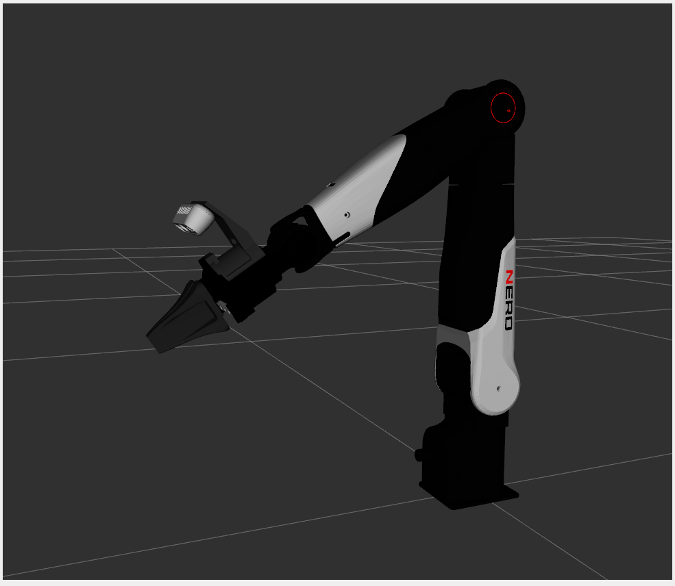

# agx_arm_description README

AgileX 系列机械臂的 ROS 2 Description 功能包。 通过统一的 Xacro 入口文件 `urdf/agx_arm_description.urdf.xacro`，以参数化方式支持多种机械臂型号、末端执行器、相机支架和 RealSense D435 相机的灵活组合，在 RViz2 中可视化 URDF 模型。同时提供 USD 格式模型，可直接用于 Isaac Sim 等仿真环境。

## 目录

- [支持的机械臂型号](#支持的机械臂型号)
- [功能包结构](#功能包结构)
- [依赖](#依赖)
- [安装](#安装)
- [使用方法](#使用方法)
- [Launch 参数说明](#launch-参数说明)
- [常用启动命令](#常用启动命令)
- [相机支架挂载逻辑](#相机支架挂载逻辑)
- [在其他 Launch 文件中引用](#在其他-launch-文件中引用)
- [直接调用 xacro 解析](#直接调用-xacro-解析)
- [USD 模型说明](#usd-模型说明)
- [License](#license)

## 支持的机械臂型号

| `arm_type` | 型号         | 可选末端执行器                                               |
| ---------- | ------------ | ------------------------------------------------------------ |
| `piper`    | Piper        | `none` / `gripper` / `revo2_left` / `revo2_right` / `teach` / `pika` |
| `piper_h`  | Piper H      | `none` / `gripper` / `revo2_left` / `revo2_right` / `teach` / `pika` |
| `piper_l`  | Piper L      | `none` / `gripper` / `revo2_left` / `revo2_right` / `teach` / `pika` |
| `piper_x`  | Piper X      | `none` / `gripper` / `revo2_left` / `revo2_right` / `teach` / `pika` |
| `nero`     | Nero         | `none` / `gripper` / `revo2_left` / `revo2_right` / `teach` / `pika` |
| `revo2`    | Revo2 灵巧手 | 通过 `revo2_side` 参数选择 `left` / `right`                  |

## 功能包结构

```Plain
agx_arm_description/
├── agx_arm_urdf/ # git submodule（来自 agilexrobotics/agx_arm_urdf）
│ ├── piper/
│ │ ├── meshes/dae/
│ │ └── urdf/
│ ├── piper_h/
│ ├── piper_l/
│ ├── piper_x/
│ ├── nero/
│ └── revo2/
├── meshes/
│ └── realsense_mid_stand.dae # 相机支架 3D 模型
├── urdf/
│ ├── agx_arm_description.urdf.xacro # 统一入口 Xacro 文件
│ ├── teach_pendant.urdf.xacro # 示教器模型文件
│ ├── pika2_gripper.urdf # Pika2 夹爪模型文件
│ └── *.usd # 各类机械臂的 USD 格式模型，支持仿真环境
├── launch/
│ ├── display.launch.py # 主 launch：带 RViz2 可视化
├── config/
│ └── arm_config.yaml
├── rviz/
│ └── default.rviz
├── CMakeLists.txt
└── package.xml
```

## 依赖

**ROS 2 包：**

```bash
sudo apt install \
ros-$ROS_DISTRO-robot-state-publisher \
ros-$ROS_DISTRO-joint-state-publisher \
ros-$ROS_DISTRO-joint-state-publisher-gui \
ros-$ROS_DISTRO-rviz2 \
ros-$ROS_DISTRO-xacro
```

## 安装

### 1. 克隆并初始化子模块

```bash
cd ~/ros2_ws/src
# 克隆本功能包
git clone https://github.com/agilexrobotics/agx_arm_sim.git
# 初始化 agx_arm_urdf 子模块
cd agx_arm_description
git submodule update --init --recursive
```

### 2. 安装依赖并编译

```bash
cd ~/ros2_ws
rosdep install --from-paths src --ignore-src -r -y
colcon build
source install/setup.bash
```

## 使用方法

### Launch 参数说明

| 参数                | 默认值   | 可选值                                                     | 说明                                                         |
| ------------------- | -------- | ---------------------------------------------------------- | ------------------------------------------------------------ |
| `arm_type`          | `piper`  | `piper`/`piper_h`/`piper_l`/`piper_x`/`nero`/`revo2`       | 机械臂型号                                                   |
| `end_effector`      | `none`   | `none`/`gripper`/`revo2_left`/`revo2_right`/`teach`/`pika` | 末端执行器（`revo2` 型号无效）：`teach` 为示教器模型，`pika` 为 Pika2 电动夹爪 |
| `revo2_side`        | `right`  | `left`/`right`                                             | 仅当 `arm_type:=revo2` 时生效                                |
| `with_camera_stand` | `false`  | `true`/`false`                                             | 是否加载相机支架                                             |
| `with_camera`       | `false`  | `true`/`false`                                             | 是否加载 RealSense D435（需同时设 `with_camera_stand:=true`） |
| `use_gui`           | `true`   | `true`/`false`                                             | 是否启动关节滑条 GUI                                         |
| `rviz_config`       | 内置配置 | 任意 `.rviz` 路径                                          | 自定义 RViz2 配置文件                                        |

### 常用启动命令

```bash
# 默认（piper 基础型，无末端，无相机）
ros2 launch agx_arm_description display.launch.py

# 指定型号
ros2 launch agx_arm_description display.launch.py arm_type:=piper_h

# 带夹爪
ros2 launch agx_arm_description display.launch.py arm_type:=piper end_effector:=gripper

# 带右手灵巧手
ros2 launch agx_arm_description display.launch.py arm_type:=nero end_effector:=revo2_right

# revo2 左手
ros2 launch agx_arm_description display.launch.py arm_type:=revo2 revo2_side:=left

# 带 Pika2 夹爪
ros2 launch agx_arm_description display.launch.py arm_type:=piper end_effector:=pika

# 带示教器
ros2 launch agx_arm_description display.launch.py arm_type:=piper end_effector:=teach

# 带相机支架（不含相机）
ros2 launch agx_arm_description display.launch.py \
arm_type:=piper end_effector:=gripper \
with_camera_stand:=true

# 带相机支架 + RealSense D435
ros2 launch agx_arm_description display.launch.py \
arm_type:=piper end_effector:=gripper \
with_camera_stand:=true with_camera:=true

# nero + 夹爪 + 相机（自动使用 nero 专属挂载偏移）
ros2 launch agx_arm_description display.launch.py \
arm_type:=nero end_effector:=gripper \
with_camera_stand:=true with_camera:=true
```

可视化nero + 夹爪 + 相机

```
ros2 launch agx_arm_description display.launch.py \
arm_type:=nero end_effector:=gripper \
with_camera_stand:=true with_camera:=true
```



## 相机支架挂载逻辑

相机支架默认固定挂载在末端法兰盘（gripper_base）上，针对不同的机械臂型号，会自动适配对应的挂载偏移量，保证相机安装位置的准确性。

## 在其他 Launch 文件中引用

你可以在自己的 Launch 文件中直接引用本功能包的参数化 URDF 生成逻辑：

```python
from launch import LaunchDescription
from launch_ros.actions import Node
import xacro

def generate_launch_description():
    # 处理 xacro 文件
    xacro_file = os.path.join(
        get_package_share_directory("agx_arm_description"),
        "urdf", "agx_arm_description.urdf.xacro"
    )
    robot_description_content = xacro.process_file(
        xacro_file,
        mappings={
            "arm_type": "piper",
            "end_effector": "gripper",
            "with_camera_stand": "true",
            "with_camera": "true"
        }
    ).toxml()

    # 启动 robot_state_publisher
    return LaunchDescription([
        Node(
            package="robot_state_publisher",
            executable="robot_state_publisher",
            parameters=[{"robot_description": robot_description_content}],
        )
    ])
```

## 直接调用 xacro 解析

> **环境要求**：该操作需要依赖 ROS2 提供的`xacro`工具，如果你尚未安装，可通过以下命令安装：
>
> ```bash
> sudo apt install ros-$ROS_DISTRO-xacro
> ```
>
> 注意：本仓库的 xacro 文件使用了 ROS 的包路径查找语法（`$(find ...)`），无法使用脱离 ROS 的独立版 xacro 库解析，必须在 ROS2 环境下使用官方提供的 xacro 工具。

无需 ROS 2 launch，可直接在命令行解析 xacro 文件进行调试：

```bash
# piper 基础型
xacro urdf/agx_arm_description.urdf.xacro arm_type:=piper

# nero + 夹爪 + 相机
xacro urdf/agx_arm_description.urdf.xacro \
arm_type:=nero \
end_effector:=gripper \
with_camera_stand:=true \
with_camera:=true

# piper + 示教器
xacro urdf/agx_arm_description.urdf.xacro arm_type:=piper end_effector:=teach

# piper + Pika2 夹爪
xacro urdf/agx_arm_description.urdf.xacro arm_type:=piper end_effector:=pika

# 输出到文件
xacro urdf/agx_arm_description.urdf.xacro arm_type:=piper > piper.urdf
```

### 使用 ros2 xacro 工具转换

你也可以使用 ROS2 官方的 `ros2 xacro` 工具来完成转换，该工具会自动处理 ROS 环境的包路径查找，适合在 ROS2 工作空间中使用：

```bash
# 以 nero 型号为例，将带夹爪+相机的完整配置转换为 urdf 文件
ros2 run xacro xacro \
urdf/agx_arm_description.urdf.xacro \
arm_type:=nero \
end_effector:=gripper \
with_camera_stand:=true \
with_camera:=true \
-o nero_full.urdf
```

### 使用 Python xacro 库直接转换

如果你需要在 Python 代码中直接完成转换，可以使用 `xacro` 库的 API 来处理，同样以 nero 型号为例：

```python
import xacro
import os
from ament_index_python.packages import get_package_share_directory

# 获取功能包的安装路径
pkg_share_dir = get_package_share_directory("agx_arm_description")
xacro_file_path = os.path.join(pkg_share_dir, "urdf", "agx_arm_description.urdf.xacro")

# 处理 xacro 文件，传入 nero 型号的配置参数
robot_urdf_content = xacro.process_file(
    xacro_file_path,
    mappings={
        "arm_type": "nero",
        "end_effector": "gripper",
        "with_camera_stand": "true",
        "with_camera": "true"
    }
).toxml()

# 将生成的 urdf 内容保存到文件
with open("nero_full.urdf", "w", encoding="utf-8") as f:
    f.write(robot_urdf_content)
```

## USD 模型说明

本功能包同时提供了各类机械臂的 USD 格式模型文件，存放于 `urdf/` 目录下，可直接导入 Isaac Sim 等仿真环境中使用，无需额外的格式转换，开箱即用。

## License

MIT License
